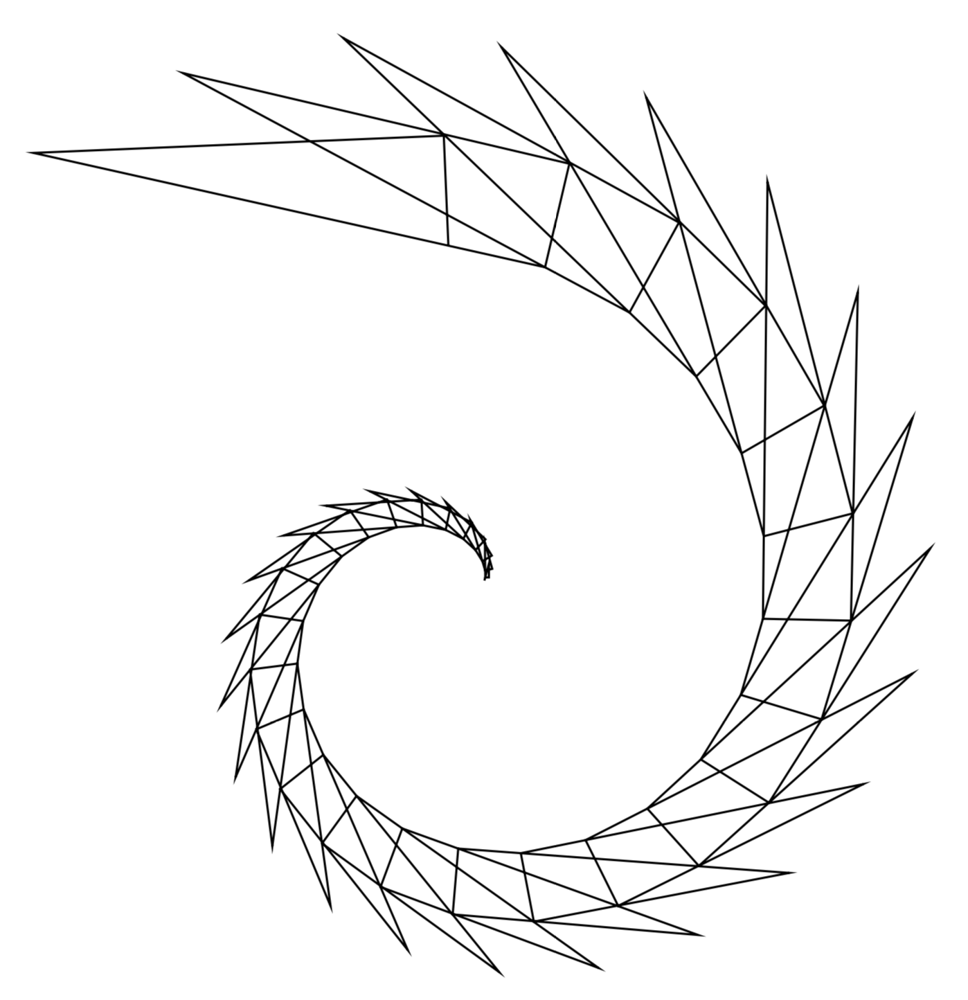

# turtle-to-postscript
A Logo-to-PostScript programming language translator

## Description
This is a Logo-to-PostScript programming language translator based on flex and bison.

## Source Code Structure
* Makefile
* src/
  * turtle.l
    * Lexical parser of the turtle language
  * turtle.y
    * Syntax parser of the turtle language. It uses LR parsing to resolve the dangling else problem.
  * symtab.c, symtab.h
    * A hash-table based symbol table. The hash table is implemented with separate chaining with linked lists.
  * token.h
    * An alternative definition of tokens used for developing lexical parser
* tests/
  * Unit tests
* demos/
  * Demo turtle programs

## How to Run
A turtle executable will be created by running 'make' in the root directory. The turtle executable reads a turtle program from standard input and write PostScript program to standard output. The PostScript program (\*.ps) can be viewed with PostScript viewers.
```
make
./turtle < prog.tlt > prog.ps
make clean
```

## Demos
* Fibonacci Monster

* Dragon Curve

* Spiral


## References
* Logo
  > https://en.wikipedia.org/wiki/Logo_(programming_language)
* PostScript
  > https://en.wikipedia.org/wiki/PostScript
* LR Parser
  > https://en.wikipedia.org/wiki/LR_parser
* Dangling Else Problem
  > https://en.wikipedia.org/wiki/Dangling_else
* Flex
  > https://en.wikipedia.org/wiki/Flex_(lexical_analyser_generator)
* Bison
  > https://en.wikipedia.org/wiki/GNU_bison
